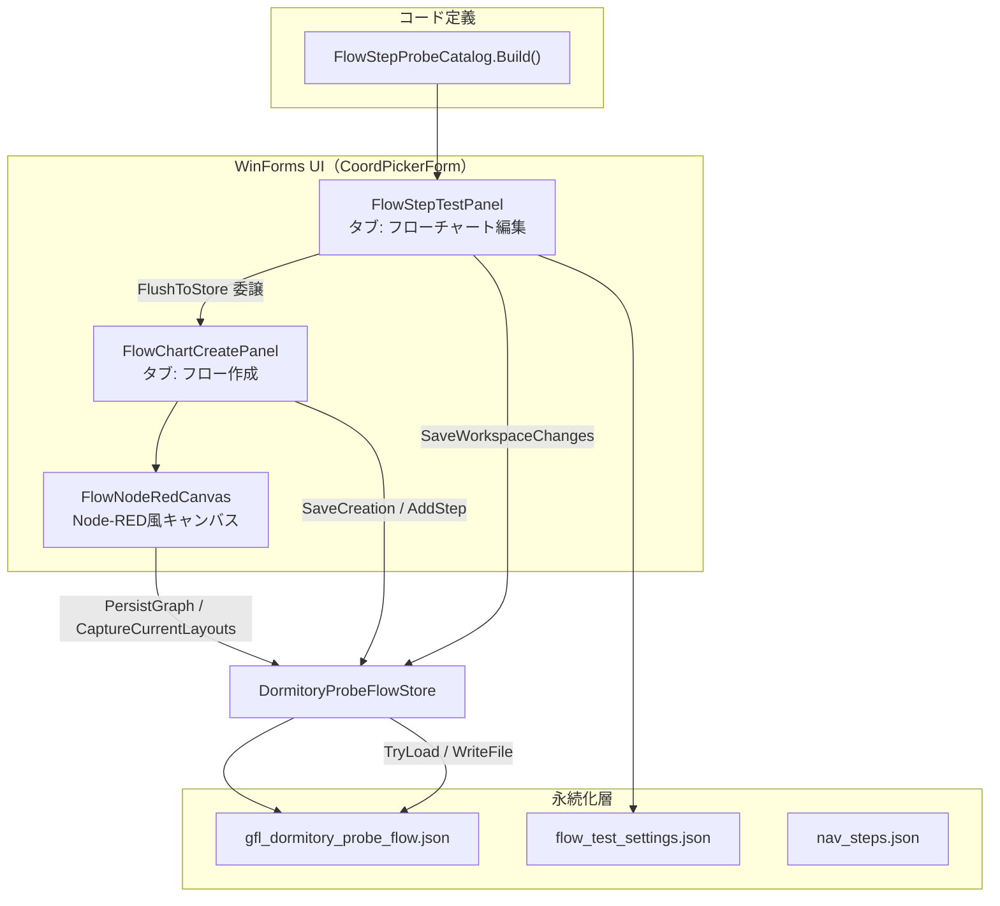

# フローチャート編集システム構造レポート

**対象:** NewMaaGfl1 / GflAssistant 座標ピッカー  
**正本 JSON:** `../NewMaaGfl1/gfl-assistant/Assets/gfl_dormitory_probe_flow.json`  
**作成日:** 2026-06-12  
**根拠:** 現行ソースコード（`../NewMaaGfl1/gfl-assistant/GflAssistant/Ui/` 配下）の解析結果

> 本アプリは **React Flow ではなく C# WinForms** です。HTTP API はなく、同一プロセス内の `File.WriteAllText` による同期ファイル I/O が「バックエンド」に相当します。

---

## 0. アーキテクチャ概要



### 主要ファイル一覧

| ファイル | 役割 |
|---------|------|
| `CoordPickerForm.cs` | タブ構成、フロー JSON パス、タブ間イベント配線 |
| `FlowChartCreatePanel.cs` | フロー作成タブ（🪄整列、「作成を保存」） |
| `FlowStepTestPanel.cs` | フローチャート編集タブ（「変更を保存」） |
| `FlowNodeRedCanvas.cs` | キャンバス、ズーム、ドラッグ保存、座標キャプチャ |
| `DormitoryProbeFlowStore.cs` | JSON 読み書き、`SaveCanvasState`、`WriteFile` |
| `FlowDagreLayout.cs` | 自動整列アルゴリズム（dagre 相当） |
| `FlowChartTheme.cs` | ダーク UI、コンパクトボタン |
| `FlowPathResolver.cs` | 画面上部フローパスの解決 |

### フロー JSON パスの切り替え

画面上部の「フローJSON」入力 → `CoordPickerForm.ApplyFlowProgramPath()` → `DormitoryProbeFlowStore.SetCustomFlowFilePath()` で読み書き先が切り替わる。

```csharp
// DormitoryProbeFlowStore.GetPath(assetsDir)
// _customFlowFilePath が設定されていればそちらを優先、なければ assetsDir/gfl_dormitory_probe_flow.json
```

---

## 1. 現在の JSON データ構造（スキーマ）

### 1-1. 型定義の正本

`../NewMaaGfl1/gfl-assistant/GflAssistant/Ui/DormitoryProbeFlowStore.cs` の以下3クラスが JSON スキーマの正本です。

| クラス | 役割 |
|--------|------|
| `DormitoryProbeFlowFile` | ルートオブジェクト |
| `DormitoryProbeFlowStepDto` | 各手順（ノード） |
| `DormitoryProbeFlowWireDto` | ノード間配線 |

シリアライズ設定:

- `PropertyNamingPolicy = CamelCase`（JSON キーは camelCase）
- `DefaultIgnoreCondition = WhenWritingNull`（null は出力しない）
- `WriteIndented = true`

### 1-2. ルート `DormitoryProbeFlowFile` のキー

| JSON キー | C# プロパティ | 型 | 説明 |
|-----------|--------------|-----|------|
| `name` | `Name` | string | フロー名 |
| `description` | `Description` | string | 短い説明 |
| `overviewJa` | `OverviewJa` | string? | 人間向け長文説明 |
| `refWidth` | `RefWidth` | int | 基準解像度幅（既定 1280） |
| `refHeight` | `RefHeight` | int | 基準解像度高さ（既定 720） |
| `updatedAt` | `UpdatedAt` | DateTime | 最終更新日時 |
| `steps` | `Steps` | array | 手順配列 |
| `wires` | `Wires` | array | 配線配列 |

### 1-3. `steps[]` 各要素のキー

| JSON キー | C# プロパティ | 型 | 説明 |
|-----------|--------------|-----|------|
| `order` | `Order` | int | 実行順番号 |
| `phaseTitle` | `PhaseTitle` | string | フェーズ名 |
| `slug` | `Slug` | string | 一意識別子 |
| `label` | `Label` | string | ノード表示名 |
| `template` | `Template` | string? | テンプレ相対パス |
| `greenMaskTemplate` | `GreenMaskTemplate` | string? | 緑マスクテンプレ |
| `navPoint` | `NavPoint` | string? | nav_steps 連携キー |
| `optional` | `Optional` | bool | 任意分岐か |
| `enabled` | `Enabled` | bool | 有効/無効 |
| `expectedScreen` | `ExpectedScreen` | string? | 期待画面 |
| `useSearchRoi` | `UseSearchRoi` | bool | ROI 使用 |
| `roiX` / `roiY` / `roiWidth` / `roiHeight` | 各 int | 検索範囲 |
| `threshold` | `Threshold` | double | マッチ閾値 |
| `useGreenMask` | `UseGreenMask` | bool | 緑マスク使用 |
| `templateStepNumber` | `TemplateStepNumber` | int | nav 記録番号 |
| `recordName` | `RecordName` | string | 記録名 |
| `hasTemplateCrop` | `HasTemplateCrop` | bool | 切り抜き有無 |
| `cropX` / `cropY` / `cropWidth` / `cropHeight` | 各 int | 切り抜き矩形 |
| `clientX` / `clientY` | `ClientX` / `ClientY` | int? | クリック座標 |
| `prerequisite` | `Prerequisite` | string | 前提条件 |
| `onFoundBehavior` | `OnFoundBehavior` | string | 検出時挙動 |
| `onNotFoundBehavior` | `OnNotFoundBehavior` | string | 未検出時挙動 |
| `summaryJa` | `SummaryJa` | string? | 要約（自動生成） |
| `settingsJa` | `SettingsJa` | string? | 設定説明（自動生成） |
| `flowJa` | `FlowJa` | string? | フロー説明（自動生成） |
| `hintJa` | `HintJa` | string? | ヒント |
| **`layoutX`** | `LayoutX` | int | **キャンバス X 座標** |
| **`layoutY`** | `LayoutY` | int | **キャンバス Y 座標** |

### 1-4. `wires[]` 各要素のキー

| JSON キー | C# プロパティ | 説明 |
|-----------|--------------|------|
| `fromSlug` | `FromSlug` | 出力元ノード slug |
| `fromPort` | `FromPort` | 出力ポート（既定 `"out"`） |
| `toSlug` | `ToSlug` | 入力先ノード slug |
| `toPort` | `ToPort` | 入力ポート（既定 `"in"`） |

### 1-5. 実ファイルのサンプル構造（抜粋）

```json
{
  "name": "宿巡回フローテスト",
  "description": "座標ピッカー フローチャート編集用。...",
  "overviewJa": "ドールズフロントライン2（少女前线2）の宿巡回フローです。...",
  "refWidth": 1280,
  "refHeight": 720,
  "updatedAt": "2026-06-12T01:26:35.7712509+09:00",
  "steps": [
    {
      "order": 1,
      "phaseTitle": "Home → 宿画面",
      "slug": "open_clock_panel",
      "label": "時計パネルを開く",
      "template": "templates/btn_clock.png",
      "optional": false,
      "enabled": true,
      "useSearchRoi": true,
      "roiX": 0,
      "roiY": 280,
      "roiWidth": 140,
      "roiHeight": 140,
      "threshold": 0.75,
      "layoutX": 100,
      "layoutY": 60
    }
  ],
  "wires": [
    {
      "fromSlug": "open_clock_panel",
      "fromPort": "out",
      "toSlug": "battery_button",
      "toPort": "in"
    }
  ]
}
```

---

## 2. ノード追加と保存の連携フロー

### 2-1. フロントエンドの「State」とは何か

React Flow の state ではなく、WinForms 上の次のメモリ構造です。

**`FlowNodeRedCanvas`（作成タブのキャンバス）**

- `_steps: List<DormitoryProbeFlowStepDto>` — ノードデータ
- `_wires: List<DormitoryProbeFlowWireDto>` — 配線データ
- `_nodes: Dictionary<string, FlowNodeRedNodeControl>` — 画面上の WinForms コントロール

**`FlowStepTestPanel`（編集タブ）**

- `_steps: List<FlowStepProbeItem>` — **カタログ**（`FlowStepProbeCatalog.Build`）由来
- `_workspaceBySlug` — `flow_test_settings.json` 由来の設定

→ **作成タブと編集タブは別の in-memory モデルを持つ**（同期ズレの根源）。

### 2-2. 「手順を追加」ボタンの呼び出し順

```
[UI] FlowChartCreatePanel コンストラクタ
  addBtn.Click → ShowAddStepDialog()

ShowAddStepDialog()  [FlowChartCreatePanel.cs]
  ① DormitoryProbeFlowStore.TryLoad(_assetsDir)     // JSON 読み込み
  ② FlowStepAddDialog.ShowDialog()                  // ユーザー入力
  ③ DormitoryProbeFlowStore.AddStep(...)            // JSON へ1件追加・即書き込み
       ├─ TryLoad / new DormitoryProbeFlowFile
       ├─ ToDto(probeItem, ...)
       ├─ AssignNewNodeLayout(dto, ...)             // layoutX/Y 初期値
       ├─ file.Steps.Insert(...)
       ├─ RenumberOrders(...)
       ├─ InsertWireForNewStep(...) / BuildDefaultWires(...)
       ├─ DormitoryProbeFlowNarratives.EnrichFile(file)
       └─ WriteFile(assetsDir, file)                // ★ ここでディスク書き込み

  ④ ReloadChart()                                   // キャンバス再構築
       ├─ _canvas.FlushGraphToStore(false)           // 既存ノードがあれば先に保存
       ├─ DormitoryProbeFlowStore.TryLoad(_assetsDir)
       ├─ EnsureNodeRedDefaults (layout が全0のとき)
       └─ _canvas.LoadGraph(file, _selectedSlug)    // _steps/_wires/_nodes 再構築

  ⑤ StepAdded?.Invoke(slug)                         // 編集タブへ通知
       → CoordPickerForm で _flowChartEditPanel.ReloadFromFlow(slug)
```

**要点:** 「手順を追加」はダイアログ確定時点で `AddStep` → `WriteFile` が1回走り、JSON に即反映される。「作成を保存」は不要。

### 2-3. ノードドラッグ時の自動保存（作成タブ）

```
FlowNodeRedNodeControl ドラッグ終了
  → FlowNodeRedCanvas.OnNodeMouseUp()
    → PersistGraph(updateExecutionOrder: false)
      → FlushGraphToStore(false)
        → CaptureCurrentLayouts()
            → SyncLayoutsFromNodes()   // WinForms Left/Top → layoutX/Y
        → DormitoryProbeFlowStore.SaveFlowGraph(AssetsDir, layouts, _wires, false)
            → TryLoad → layoutX/Y 更新 → WriteFile
      → GraphChanged?.Invoke(false)
        → FlowChartCreatePanel.OnGraphChangedHandler()
           ステータス表示「ノード位置を保存しました」
```

**要点:** ドラッグ離しのたびに JSON へ自動書き込みされる。

### 2-4. 「作成を保存」ボタンの呼び出し順

```
saveBtn.Click → SaveCreation()  [FlowChartCreatePanel.cs]

SaveCreation()
  ① DormitoryProbeFlowStore.GetPath(_assetsDir)     // 書き込み先パス確認
  ② File.Exists(flowPath) チェック
  ③ _canvas.CaptureCurrentLayouts()                 // ★ 最新座標を同期
  ④ _canvas.CaptureCurrentWires()                  // ★ 最新配線を取得
  ⑤ DormitoryProbeFlowStore.SaveCanvasState(_assetsDir, layouts, wires)
       ├─ SaveFlowGraph(assetsDir, layouts, wires, updateExecutionOrder: false)
       │    → TryLoad → layoutX/Y・wires 更新 → WriteFile  ★1回目
       └─ SaveFlowDefinition(assetsDir, layouts, wires)
            → TryLoad → 自然言語フィールド再生成 + layout 再適用 → WriteFile  ★2回目
  ⑥ File.GetLastWriteTime(flowPath)                 // 更新時刻確認
  ⑦ DormitoryProbeFlowStore.TryLoad(_assetsDir)      // ディスク読み戻し検証
  ⑧ layoutX/Y が一致するか照合（不一致なら警告 MessageBox）
  ⑨ CreationSaved?.Invoke()
       → _flowChartEditPanel.ReloadFromFlow()
```

### 2-5. 🪄 自動整列ボタンの呼び出し順

```
autoLayoutBtn.Click → ApplyAutoLayout()  [FlowChartCreatePanel.cs]

ApplyAutoLayout()
  ① _canvas.ApplyAutoLayout()
       → FlowDagreLayout.Compute(_steps, _wires)
       → step.LayoutX/Y と node 位置を更新
  ② _canvas.CaptureCurrentLayouts()
  ③ _canvas.CaptureCurrentWires()
  ④ DormitoryProbeFlowStore.SaveFlowGraph(_assetsDir, layouts, wires, false)
       → WriteFile
```

### 2-6. 「変更を保存」ボタン（編集タブ）の呼び出し順

```
FlowStepTestPanel.SaveWorkspaceChanges()

  ① ReadWorkspaceFromUi() / FinalizeForSave()
  ② FlowChartFlushRequested?.Invoke()
       → CoordPickerForm で _flowChartCreatePanel.FlushToStore() に委譲
         → CaptureCurrentLayouts + CaptureCurrentWires
         → SaveFlowGraph(_assetsDir, ...)  ★ レイアウト先行保存

  ③ FlowStepSettingsStore.SaveAll(_assetsDir, _workspaceBySlug)
  ④ DormitoryProbeFlowStore.Save(_assetsDir, _steps, _workspaceBySlug, _navRegistry)
       ├─ TryLoad → existing から layout/wires スナップショット
       ├─ catalogList + workspaces をマージして steps 再構築
       ├─ TryLoad 再読み（直前の SaveFlowGraph 反映）で layout/wires 上書き保護
       └─ WriteFile  ★ 手順設定込みの全面書き込み

  ⑤ FlowChartRefreshRequested?.Invoke()
       → _flowChartCreatePanel.RefreshFromStore()
```

### 2-7. 物理書き込みの最終地点

すべての保存は `DormitoryProbeFlowStore.WriteFile()` に集約される。

```csharp
private static void WriteFile(string assetsDir, DormitoryProbeFlowFile file)
{
    DormitoryProbeFlowNarratives.EnrichFile(file);
    string path = GetPath(assetsDir);
    Directory.CreateDirectory(Path.GetDirectoryName(path)!);
    File.WriteAllText(path, JsonSerializer.Serialize(file, JsonOptions));
}
```

HTTP POST 等のバックエンド API は存在しない。

### 2-8. タブ間イベント配線（CoordPickerForm.cs）

| イベント | 配線 |
|---------|------|
| `FlowChartFlushRequested` | `_flowChartCreatePanel.FlushToStore` |
| `FlowChartRefreshRequested` | `_flowChartCreatePanel.RefreshFromStore` |
| `FlowChartReloadRequested` | `_flowChartCreatePanel.ReloadChart` |
| `CreationSaved` | `_flowChartEditPanel.ReloadFromFlow` |
| `StepAdded` / `StepDeleted` / `StepOrderChanged` | `_flowChartEditPanel.ReloadFromFlow` |

---

## 3. 保存が効かない／同期ズレのコード上の原因

### 3-1. 【確定済み・過去の致命的原因】テストが本物 JSON を破壊

| 項目 | 内容 |
|------|------|
| 関数 | `DormitoryProbeFlowStore.ExportCatalog()` |
| 動作 | 既存 JSON を **削除** してカタログ定義から再生成 |
| 呼び出し元 | `dotnet test` の `宿巡回フロー定義をgfl_dormitory_probe_flow_jsonにエクスポートする` |
| 症状 | 座標ピッカーで保存しても、テスト実行後に JSON が初期状態に戻る |
| 現状 | テストは `TestPaths.CreateWritableAssetsCopy()` の一時フォルダのみ使用（修正済み） |

`ExportCatalog` はコメントにも「座標ピッカー編集は失われる」と明記されている。

### 3-2. 【修正済み・過去の保存バグ】State と保存データの非同期

| 項目 | 内容 |
|------|------|
| 症状 | 「作成を保存」押下でも `layoutX/Y` が JSON に入らない |
| 原因 | 保存前に WinForms コントロール座標を `_steps` に戻す処理がなかった |
| 修正 | `CaptureCurrentLayouts()` → `SyncLayoutsFromNodes()` を保存直前に必須化 |
| 修正 | `SaveCanvasState()` で `SaveFlowGraph` + `SaveFlowDefinition` を連続実行 |
| 検証 | `SaveCreation()` 内でディスク読み戻し照合を実装 |

### 3-3. 【構造的ボトルネック①】二重データモデル（最大の設計上のリスク）

| タブ | in-memory の正 | ディスクの正 |
|------|---------------|-------------|
| フローチャート**作成** | `FlowNodeRedCanvas._steps`（JSON 由来） | `gfl_dormitory_probe_flow.json` |
| フローチャート**編集** | `FlowStepProbeCatalog.Build()` + `flow_test_settings.json` | 保存時に `DormitoryProbeFlowStore.Save()` で JSON へマージ |

編集タブの手順一覧は JSON を直接読まない:

```csharp
// FlowStepTestPanel.ReloadStepsFromCatalog()
_steps = FlowStepProbeCatalog.Build(_navRegistry, _assetsDir).ToList();
```

**結果として起きうるズレ:**

- 作成タブで追加した手順の `order` / `wires` と、編集タブのカタログ順が一致しない場合がある
- 「変更を保存」の `Save()` はカタログ順を正として JSON を再構築する
- レイアウトは `Save()` 末尾の `TryLoad` 再読みで保護されるが、**手順の内容・順序は編集タブ側が優先**

### 3-4. 【構造的ボトルネック②】保存経路が5系統ある

| 経路 | 関数 | タイミング |
|------|------|-----------|
| A | `PersistGraph` → `SaveFlowGraph` | ドラッグ離し・配線変更 |
| B | `SaveCreation` → `SaveCanvasState` | 「作成を保存」 |
| C | `ApplyAutoLayout` → `SaveFlowGraph` | 🪄 整列 |
| D | `FlushToStore` → `SaveFlowGraph` | 編集タブ保存の直前 |
| E | `Save` | 編集タブ「変更を保存」本体 |

いずれも `WriteFile` で上書きする。`SaveFlowGraph(..., updateExecutionOrder: true)` は配線から実行順を再計算し `ReorderStepsInMemory` を実行する。

### 3-5. 【構造的ボトルネック③】`ReloadChart()` の副作用

`ReloadChart()` は再読み込みの**前に** `_canvas.FlushGraphToStore(false)` を呼ぶ。  
`FlushGraphToStore` が失敗しても戻り値をチェックせず `TryLoad` でディスクの古いデータを読み込む。  
`AssetsDir` が空・不正な場合、画面上の変更は失われ、古い JSON が表示される。

### 3-6. 【運用上のボトルネック】フロー JSON パスの不一致

`DormitoryProbeFlowStore.GetPath()` は `_customFlowFilePath` を優先する。  
座標ピッカーが書いているファイルと、エディタで監視しているファイルが異なると、「保存しても変わらない」ように見える（コード上は正常動作）。

確認方法: 座標ピッカー上部の「フローJSON」欄のパスと、IDE で開いている `gfl_dormitory_probe_flow.json` のパスが一致しているか。

### 3-7. 【誤解の原因】実行エンジンはこの JSON を読まない

`run-dormitory` / `DormitoryLikeTask` は `gfl_dormitory_probe_flow.json` を実行時に読まない。  
C# カタログ + `nav_steps.json` が実行正本。JSON は座標ピッカーの編集・可視化用。

---

## 4. Node-RED との比較

| 項目 | Node-RED | MaaGfl1 現行 |
|------|----------|-------------|
| ランタイム | フロー JSON がそのまま実行される | JSON は編集用。実行は C# カタログ |
| State | 単一の flow オブジェクト | 作成タブ（JSON）と編集タブ（カタログ）の二重モデル |
| 保存 | `POST /flows` 一発 | `WriteFile` が5経路から呼ばれる |
| レイアウト | `x`, `y` が flow 内 | `layoutX`, `layoutY` が steps 内 |
| 配線 | `wires: [[nodeId]]` | `wires: [{fromSlug,toSlug}]` |
| 自動整列 | dagre ライブラリ（npm） | `FlowDagreLayout.cs`（C# 自前実装） |

---

## 5. タブと保存ボタンの対応

| タブ | 保存ボタン | 主な保存内容 |
|------|-----------|-------------|
| **フロー作成** | 「作成を保存」 | ノード配置（layoutX/Y）、配線（wires）、自然言語フィールド |
| **フローチャート編集** | 「変更を保存」 | テンプレート・ROI・クリック座標・flow_test_settings |

---

## 6. 実機確認チェックリスト

1. 座標ピッカー上部の「フローJSON」パスが `../NewMaaGfl1/gfl-assistant/Assets/gfl_dormitory_probe_flow.json` と一致しているか
2. 作成タブでノードをドラッグ → ステータスに「ノード位置を保存しました」と出るか
3. 「作成を保存」後、`updatedAt` と `layoutX/Y` が変わるか
4. 🪄 整列後、ステータスに「JSON に反映済み」と出るか
5. 「再読み込み」後も保存した座標が維持されるか
6. `dotnet test` 実行後に JSON が初期化されないか（修正済みだが要確認）

---

## 7. 関連テスト

| テストファイル | 内容 |
|---------------|------|
| `GflAssistant.Tests/DormitoryProbeFlowStoreTests.cs` | JSON 保存・ExportCatalog（一時フォルダ） |
| `GflAssistant.Tests/FlowDagreLayoutTests.cs` | 自動整列の座標計算 |

起動コマンド:

```bat
gfl-assistant\scripts\coord-picker.bat
```
